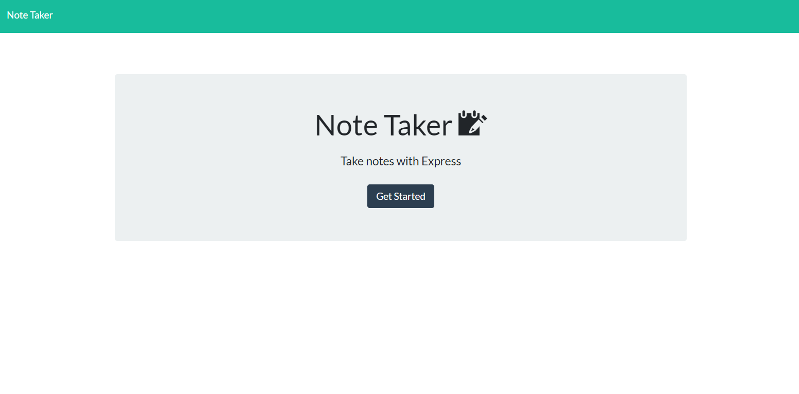

# Note-Taker

## Description:
Note Taker app is easy app for users to place note information.  Provides a handy place to write, save and delete notes.

## Table of Contents:

* [Installation](#Installation)
* [Usage](#Usage)
* [License](#License)
* [Contributing](#Contributing)
* [Questions](#Questions)

## Installation: 
Copy the link in the browser address bar

[Link] (https://warm-plains-86528.herokuapp.com/)

## Usage:

1. Click the "Get Started button" takes you to the notes.html page, you can return by the Nav-bar "Note Taker" button
2. Note Taker will display a stored list of notes on the left side.  Clicking the listed item will centrally display the Note and text.  An option to delect the note is available with click of trash can button icon.
3. Upper rightside of nav-bar displays a pencil to clear the centrally located note.
4. Entering new note text in the Title and text area opens the save button which will add to the notes display list.

##### Demo Video
https://drive.google.com/file/d/1hOnmQwpzCBIr3f9Ym9MODC8WoegdU5bC/view

##### Webpage screenshot

## License:

Permission is hereby granted, free of charge, to any person obtaining a copy
of this software and associated documentation files (the "Software"), to deal
in the Software without restriction, including without limitation the rights
to use, copy, modify, merge, publish, distribute, sublicense, and/or sell
copies of the Software, and to permit persons to whom the Software is
furnished to do so, subject to the following conditions:

The above copyright notice and this permission notice shall be included in all
copies or substantial portions of the Software.

THE SOFTWARE IS PROVIDED "AS IS", WITHOUT WARRANTY OF ANY KIND, EXPRESS OR
IMPLIED, INCLUDING BUT NOT LIMITED TO THE WARRANTIES OF MERCHANTABILITY,
FITNESS FOR A PARTICULAR PURPOSE AND NONINFRINGEMENT. IN NO EVENT SHALL THE
AUTHORS OR COPYRIGHT HOLDERS BE LIABLE FOR ANY CLAIM, DAMAGES OR OTHER
LIABILITY, WHETHER IN AN ACTION OF CONTRACT, TORT OR OTHERWISE, ARISING FROM,
OUT OF OR IN CONNECTION WITH THE SOFTWARE OR THE USE OR OTHER DEALINGS IN THE
SOFTWARE.

## Contributing:
We pledge to act and interact in ways that contribute to an open, welcoming, diverse, inclusive, and healthy community.

## Questions:

 marcstrong@yahoo.com
